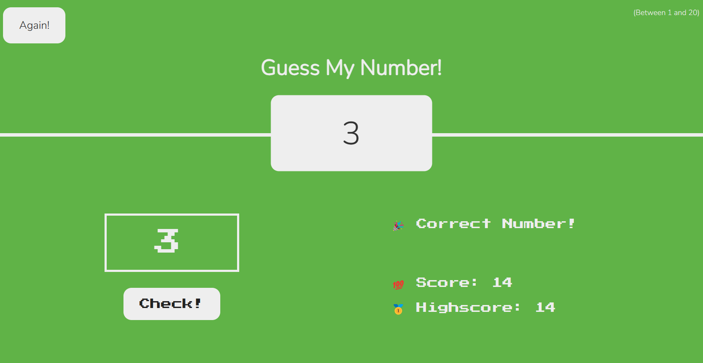

# Number Guessing Game

Welcome to the Number Guessing Game! This simple and fun game challenges you to guess the correct number within a specified range.



## How to Play

1. Start the game by running the provided script or executable.
2. The game will generate a random number between a minimum and maximum range.
3. You are prompted to enter your guess for the number.
4. Keep guessing until you find the correct number.
5. You will receive feedback after each guess, telling you if your guess is too high or too low.
6. Try to guess the number in as few attempts as possible.
7. Once you've guessed the correct number, the game will display your highscore.

## Features

- Randomly generated numbers for endless replayability.
- Real-time feedback on your guesses.
- Track the number of attempts it takes to guess the correct number.

# wanna customize / contribute?

## Clone the repository

```bash

git clone https://github.com/Parrurox/GuessTheNum.git

```
